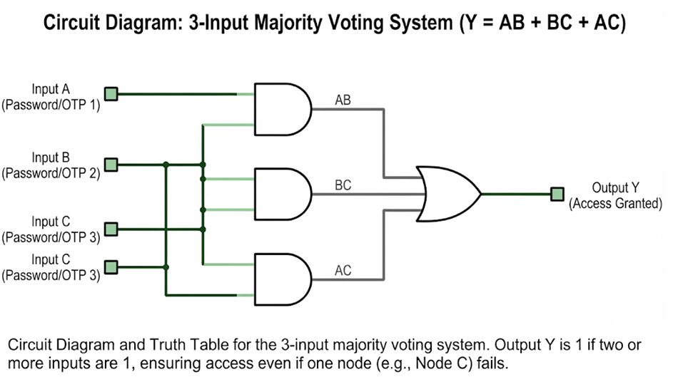
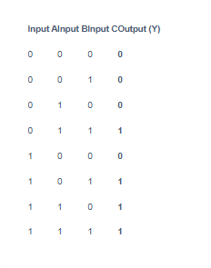

TaskA

Definition of Boolean Logic

Boolean logic is a mathematical system with only two outcomes: true or false (1 or 0). Just like a light switch where the only two possible outcomes are being completely on or completely off. Formulated by mathematician George Boole, it provides the mathematical foundation for digital computing by defining rules to combine, compare, and manipulate binary data (Walton, 2024). These rules are used both daily in logical gates in chip manufacturing and coding in software programming and search engines programming (Walton, 2024). To illustrate how the Boolean logic is used, we will use 3examples

Example: How Logic Gates Calculate 1 + 1
In binary math, 1 + 1 = 10 meaning a Sum of 0 with a Carry of 1. Modern computer chips use two basic gates to solve this:

·       XOR Gate. Takes a Boolean input of 1 and another Boolean input of 1. Because they are identical, it outputs a Boolean 0.

·       AND Gate. Takes a Boolean input of 1 and another Boolean input of 1. Because both are true, it outputs a Boolean output of 1.

Put together, the Boolean 1 and Boolean 0 equal 10. Which is 2 in decimal terms

Example: Checking if user is logged in
In programming software uses Boolean logic to make decisions. For example, If  is_logged_in = True checks if the Boolean outcome is true before granting access to an app (Walton, 2024).

Example: filtering web results to only display the relevant content
Some search engines use Boolean logic to search for the right article by splitting individual words out of a search text and match them individually with different articles. Once the searches have been done, they filter web results. For example, if user searches for "cars" AND "buses" only returns pages where the Boolean outcome for both keywords is true.

Task B 

Example: Bank Transaction Verification (Triple Modular Redundancy)
In high-security banking infrastructure, major financial systems use redundancy to ensure data accuracy and avoid fraud. For instance, when a banking system verifies a sensitive user action such as logging into the mobile bank application and making certain payments through confirming requesting a password and an OTP (One-Time Password) across redundant security nodes, it uses a majority voting architecture:

·       Boolean A. Verifies the user password/OTP credentials and outputs a Boolean verification result of True.

·       Boolean B: Verifies the user password/OTP credentials and outputs a Boolean verification result of True

·       Boolean C Encounters a temporary network glitch and outputs a Boolean result of 0 (invalid).

Using a majority voting circuit ($Y = AB + BC + AC$), the system evaluates the three outputs. Since Boolean A and B both output 1, the majority wins, and access is successfully granted, preventing a false lockout due to a minor glitch.

References

·  Mano, M. M., & Ciletti, M. D. (2018). Digital Design: With an Introduction to the Verilog HDL, VHDL, and SystemVerilog (6th ed.). Pearson.

·  Walton, D. J. (2024). Culturally Responsive Computing: An Introduction into Computer Science, Security, and Technology. Boston, MA: ROTEL.

