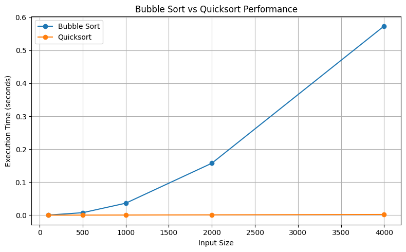

Performance Analysis of Bubble Sort and Quicksort

This practical activity implements and evaluates Bubble Sort using data from the UCI Wine Quality dataset and compares its performance with Quicksort. The alcohol column from the white wine dataset was converted into a Python list and used as the input for both algorithms. Bubble Sort works by repeatedly comparing neighbouring values. If the value on the left is greater than the value on the right, the two values are swapped. This process continues until all values are arranged in ascending order. Quicksort instead selects a pivot value, divides the data into smaller, equal and larger values, and sorts the resulting groups in a recursion.

Bubble Sort has a time complexity of O(n²). This means that its computational requirements increase rapidly as the size of the input increases. The experimental results support this behaviour. Bubble Sort processed 100 values in approximately 0.00049 seconds, 1,000 values in 0.03649 seconds, and 4,000 values in approximately 0.57324 seconds. Therefore, Bubble Sort performs adequately on small datasets but becomes increasingly inefficient for larger datasets.

Quicksort demonstrated significantly better performance. Its average time complexity is O(n log n), although its worst-case complexity can reach O(n²). In the experiment, Quicksort processed 1,000 values in approximately 0.00053 seconds and 4,000 values in only 0.00236 seconds. The accompanying performance graph illustrates this difference, as Bubble Sort's execution time rises sharply while Quicksort remains comparatively low.

In real-world applications, Bubble Sort is mainly useful for small datasets, educational purposes, or situations where simplicity is more important than performance. Quicksort is more suitable for larger datasets and applications requiring efficient sorting. Overall, the experiment demonstrates how algorithm selection can significantly affect computational performance as dataset size increases.

*Figure 1: Execution time of Bubble Sort and Quicksort for different input sizes.*
