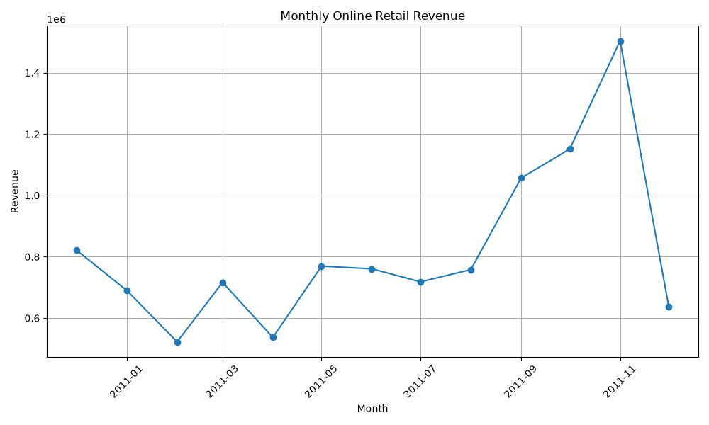
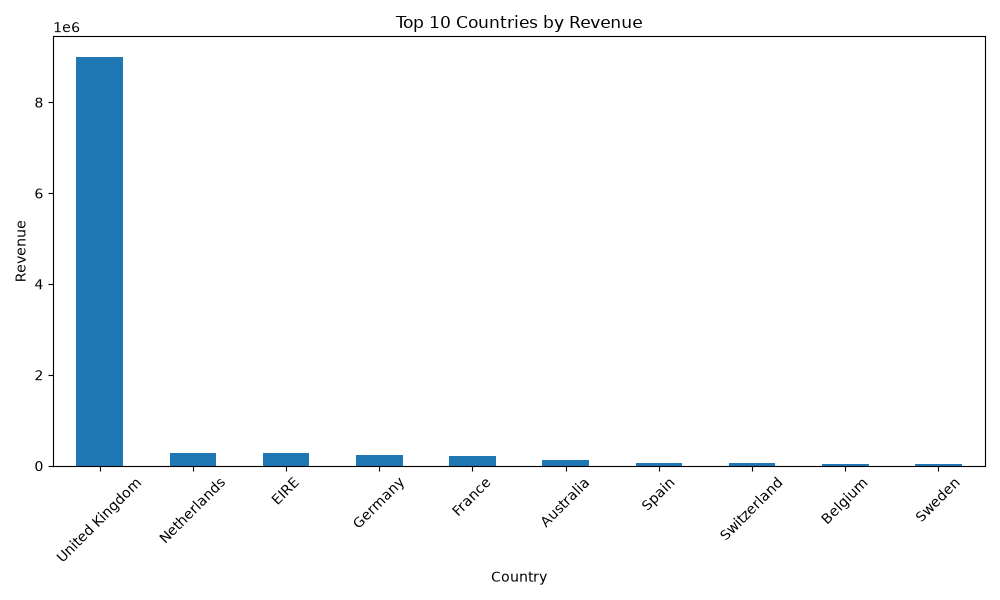

## Monthly Revenue Trend

*Figure 1: Monthly revenue trend for the Online Retail dataset.*

## Top 10 Countries by Revenue

*Figure 2: Top 10 countries ranked by total sales revenue.*

For this dataset, SQL and NoSQL are useful to compare because the Online Retail data is highly structured. Each transaction follows the same columns, including invoice number, product code, quantity, invoice date, unit price, customer ID and country. This consistent structure makes a relational SQL database a strong choice. The data could be divided into related tables such as customers, products, invoices and transaction details. SQL would also support reliable relationships between these tables and make it straightforward to perform queries such as calculating revenue by month, identifying top-selling products or comparing sales between countries.

A NoSQL database would provide greater flexibility when storing less structured or rapidly changing information. For example, an e-commerce business might also collect product reviews, website activity, customer preferences or different product attributes that do not always follow the same structure. A document-based NoSQL system could store this information without requiring every record to contain identical fields. It may also be useful when handling very large volumes of distributed web data.

For the Online Retail dataset used in this analysis, SQL would generally be more appropriate because the transactional records have a clear and consistent structure and contain relationships between customers, products and invoices. However, a larger modern e-commerce platform could use both approaches, with SQL managing structured transactions and NoSQL supporting more flexible customer and behavioural data.